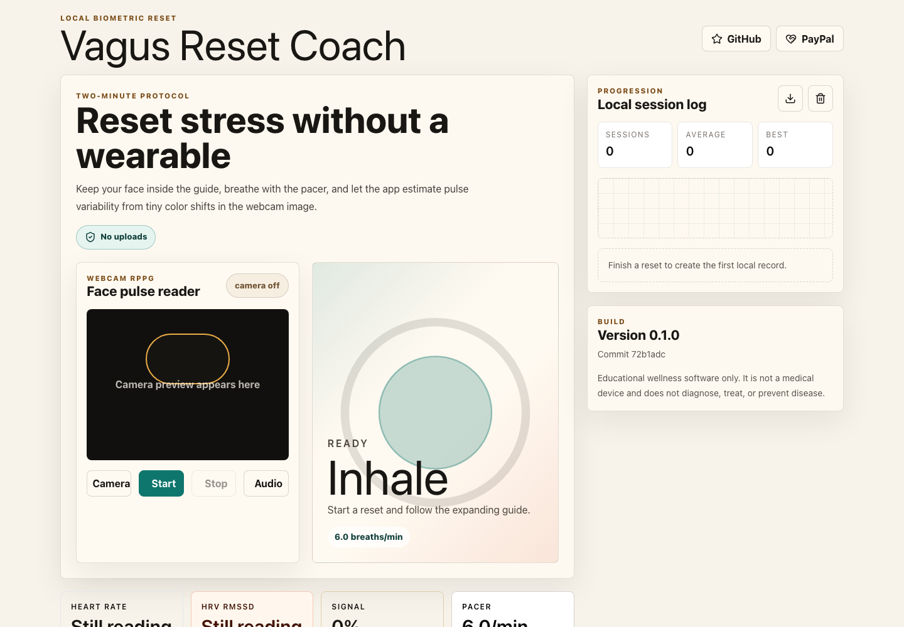
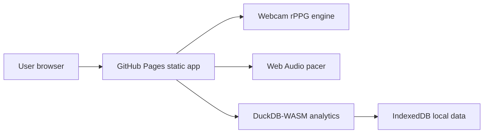

# Vagus Reset Coach


Live site: https://baditaflorin.github.io/vagus-reset-coach/

Repository: https://github.com/baditaflorin/vagus-reset-coach

Support: https://www.paypal.com/paypalme/florinbadita

Vagus Reset Coach is a private, browser-based two-minute breath coach that estimates pulse from webcam rPPG, guides breathing with audio and visuals, and keeps progress local to the browser.



## Quickstart

```bash
npm install
make install-hooks
make dev
make test
make build
```

## Verified Features

- `Camera` starts a local webcam preview and `Start` runs a reset even when the browser falls back to breath-only mode.
- Local settings persist across reload, including audio cues and adaptive/manual pacing preference.
- `Export` writes a versioned `vagus-reset-state.json` file and `Import` restores that state from file, drop, paste, or clipboard.
- `Copy` produces a portable plain-text summary and `Print` opens a print-friendly local report.
- Version and commit are shown in the published GitHub Pages build.

## Architecture

This is a Mode A GitHub Pages app. It runs fully in the browser using webcam APIs, Web Audio, DuckDB-WASM, IndexedDB, and static assets.



Read the ADRs in `docs/adr/` for the design record and `docs/privacy.md` for the privacy model.

## Limitations

- Browser camera permissions, lighting, and motion still determine whether webcam HRV is usable.
- Export/import is local-file based only. There is no cloud sync or shareable URL.
- This is educational wellness software, not a medical device.

## Checks

```bash
make lint
make test
make smoke
npm audit --audit-level=high
gitleaks detect --redact --no-git
```
