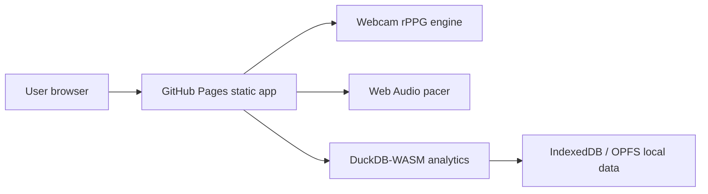

# Vagus Reset Coach

Live site: https://baditaflorin.github.io/vagus-reset-coach/

Repository: https://github.com/baditaflorin/vagus-reset-coach

Support: https://www.paypal.com/paypalme/florinbadita

Vagus Reset Coach is a private, browser-based two-minute breath coach that estimates pulse from webcam rPPG, guides breathing with audio and visuals, and logs progress locally.

## Quickstart

```bash
npm install
make dev
make test
make build
make pages-preview
```

## Architecture

This is a Mode A GitHub Pages app. It runs fully in the browser using webcam APIs, Web Audio, DuckDB-WASM, IndexedDB/OPFS, and static assets.



Read the ADRs in `docs/adr/` for the design record and `docs/privacy.md` for the privacy model.
