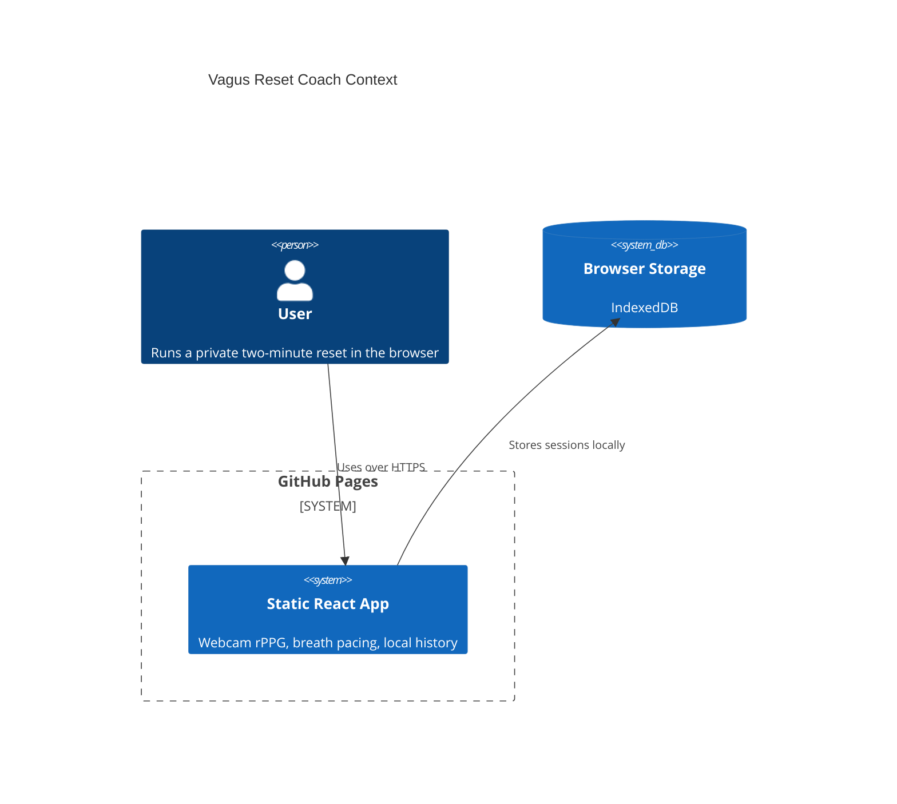
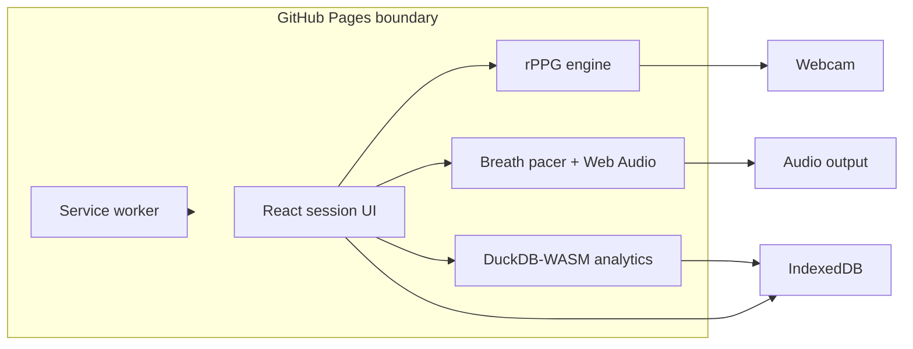

# Architecture

Live site: https://baditaflorin.github.io/vagus-reset-coach/

Repository: https://github.com/baditaflorin/vagus-reset-coach

## Context

## Container

## Boundaries

- No backend exists in v1.
- Camera frames are processed in memory and are never persisted.
- Session summaries are local browser data only.
